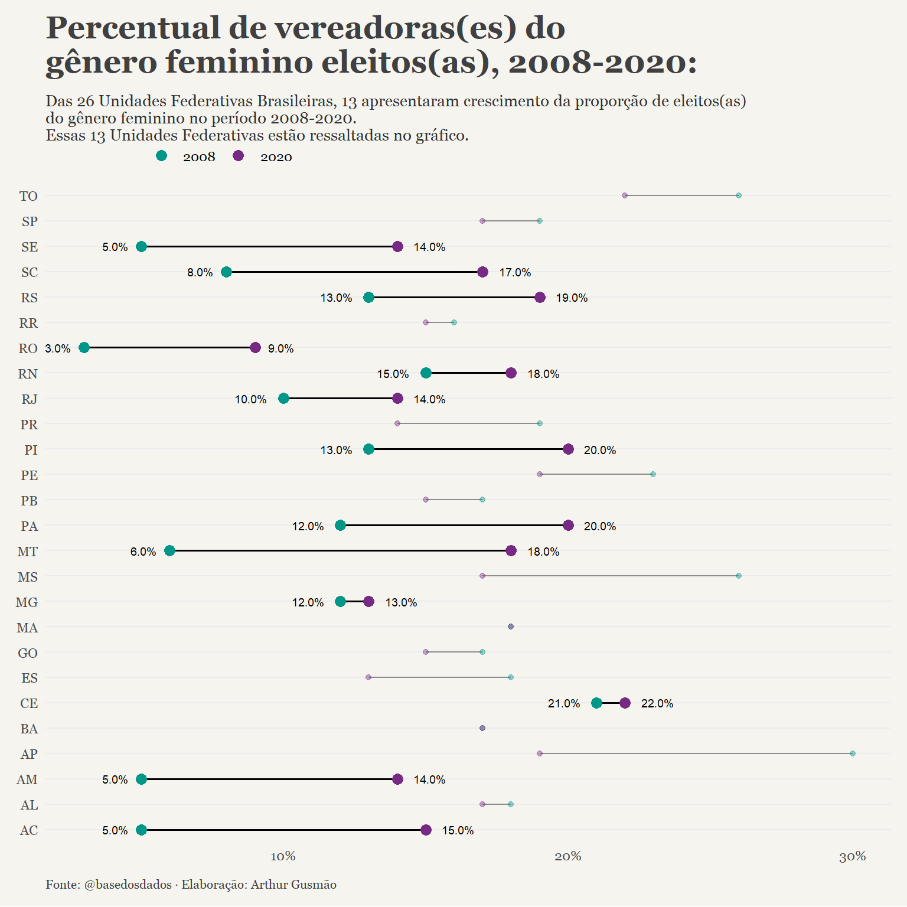

<!-- README.md is generated from README.Rmd. Please edit that file -->

# Arthur Gusmão

## O BD Case:

###### Elaborar uma visualização, usando pelo menos uma das seguintes bases:

  - **Eleições Brasileiras.**
  - **Sistema de Informações Contábeis e Fiscais do Setor Público
    Brasileiro (Siconfi).**
  - **Inflação.**

A base escolhida foi a de **Eleições Brasileiras.**

<!-- badges: start -->

<!-- badges: end -->

O código para as visualizações está em formato `.Rmd` e é completamente
reprodutível. A única ressalva fica para o `set_billing_id()` que, no
caso, contém o meu *billing id*.

## Visualizações:

### Primeira visualização:

### Segunda visualização:

