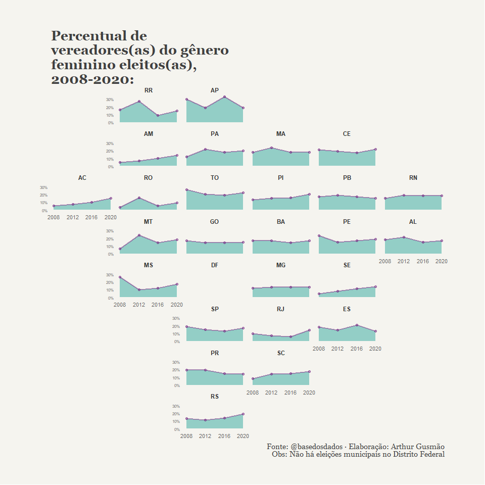
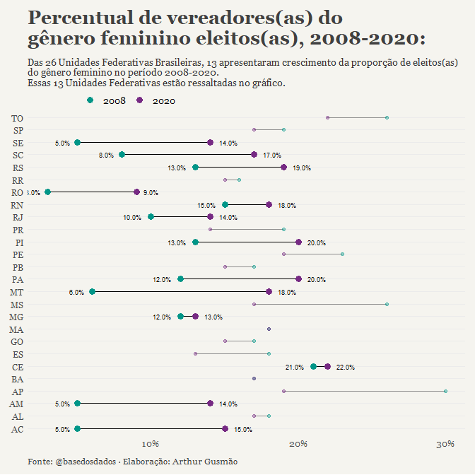

<!-- README.md is generated from README.Rmd. Please edit that file -->

# Arthur Gusmão

## O BD Case:

###### Elaborar uma visualização, usando pelo menos uma das seguintes bases:

  - **Eleições Brasileiras.**
  - **Sistema de Informações Contábeis e Fiscais do Setor Público
    Brasileiro (Siconfi).**
  - **Inflação.**

A base escolhida foi a de **Eleições Brasileiras.**

<!-- badges: start -->

<!-- badges: end -->

Então vamos nessa\! Importando os pacotes…

``` r
library(basedosdados)
#> Warning: package 'basedosdados' was built under R version 4.0.5
#> 
#> -- Base dos Dados --------------------------------------------------------------
#> * Website: https://basedosdados.org/
#> * Docs: https://basedosdados.github.io/mais/
#> 
#> -- Contatos --
#> 
#> * Discord: discord.gg/tuaFbAPeq5
#> * Twitter: @basedosdados
#> * Email: contato@basedosdados.org
#> * Telegram: t.me/joinchat/OKWc3RnClXnq2hq-8o0h_w
#> * Github: github.com/basedosdados
#> * LinkedIn: linkedin.com/company/base-dos-dados
#> * Newsletter:
#> https://basedosdados.hubspotpagebuilder.com/assine-a-newsletter-da-base-dos-dados
#> * WhatsApp: https://chat.whatsapp.com/HXWgdFc1RmwCoblly5KPBZ
#> * YouTube: https://www.youtube.com/c/BasedosDados
#> 
#> -- Somos um projeto open-source e gratuito. Para nos mantermos e crescermos precisamos do seu apoio. Quanto valem as horas do seu trabalho que poupamos?
#> 
#> Nos apoie em https://apoia.se/basedosdados.
#> 
#> -- Usando o pacote para produzir um trabalho? Para nos citar basta rodar citation('basedosdados').
library(tidyverse)
#> -- Attaching packages --------------------------------------- tidyverse 1.3.0 --
#> v ggplot2 3.3.2     v purrr   0.3.4
#> v tibble  3.1.6     v dplyr   1.0.8
#> v tidyr   1.1.0     v stringr 1.4.0
#> v readr   2.1.2     v forcats 0.5.0
#> Warning: package 'tibble' was built under R version 4.0.5
#> Warning: package 'readr' was built under R version 4.0.5
#> Warning: package 'dplyr' was built under R version 4.0.5
#> -- Conflicts ------------------------------------------ tidyverse_conflicts() --
#> x dplyr::filter() masks stats::filter()
#> x dplyr::lag()    masks stats::lag()
library(geofacet)
#> Warning: package 'geofacet' was built under R version 4.0.5
library(ggh4x)
library(plotly)
#> Warning: package 'plotly' was built under R version 4.0.5
#> 
#> Attaching package: 'plotly'
#> The following object is masked from 'package:ggplot2':
#> 
#>     last_plot
#> The following object is masked from 'package:stats':
#> 
#>     filter
#> The following object is masked from 'package:graphics':
#> 
#>     layout
library(extrafont)
#> Warning: package 'extrafont' was built under R version 4.0.5
#> Registering fonts with R
```

O objetivo da minha análise é visualizar a evolução no tempo do número
de vereadoras eleitas e compará-lo com o número de vereadores eleitos,
para todas as Unidades Federativas do Brasil. Para isso, usei a base de
eleições (do TSE), disponibilizada no *datalake*. De maneira resumida,
carreguei as bases com os resultados e fiz um `merge()` com a base dos
candidatos, que é a que contêm os dados de gênero, raça, instrução e
etc.

Baixando os dados do *datalake* com a função `basedosdados::bdplyr()` e
construindo a *query* com o `dplyr`:

``` r
set_billing_id("casebd")
#> Project keys set successfully

## base de resultados
query <- bdplyr("br_tse_eleicoes.resultados_candidato") %>%
  select(ano, id_municipio, sigla_uf,
         turno, tipo_eleicao, cargo,
         numero_candidato, id_candidato_bd,
         resultado, ano)%>%
  filter(ano > 2007,cargo == "vereador", resultado != "nao eleito")
#> ! Using an auto-discovered, cached token.
#>   To suppress this message, modify your code or options to clearly consent to
#>   the use of a cached token.
#>   See gargle's "Non-interactive auth" vignette for more details:
#>   <https://gargle.r-lib.org/articles/non-interactive-auth.html>
#> i The bigrquery package is using a cached token for 'arthurgusmao@id.uff.br'.
#> Auto-refreshing stale OAuth token.
#> Successfully connected to table `basedosdados.br_tse_eleicoes.resultados_candidato`.

df_resultado <- bd_collect(query)


## base de candidatos

query2 <- bdplyr("br_tse_eleicoes.candidatos") %>%
  select(ano,sigla_uf,id_candidato_bd,nome,situacao,ocupacao, genero, idade,instrucao,raca)%>%
  filter(ano > 2007)
#> Successfully connected to table `basedosdados.br_tse_eleicoes.candidatos`.

df_candidatos <- bd_collect(query2)

#query3 <- bdplyr("br_me_siconfi.municipio_despesas_funcao")%>%
  #filter(sigla_uf == "RJ", ano >2012)

#df_despesas <- bd_collect(query3)

query4 <- bdplyr("br_bd_diretorios_brasil.uf")%>%
  select(sigla, nome)
#> Successfully connected to table `basedosdados.br_bd_diretorios_brasil.uf`.

diretorio <- bd_collect(query4)
```

Como disse, fiz o `merge()` das bases de candidatos e do resultado das
eleições, e também fiz um `merge()` com a base de **diretórios**, para
facilitar a visualização dos nomes das UF’s.

``` r

candidatos_merged <- merge(df_candidatos, df_resultado, by = c("id_candidato_bd","ano"))

diretorio <- diretorio %>%
  rename(nome_uf = nome, sigla_uf = sigla) #%>%

candidatos_merged <- merge(candidatos_merged, diretorio, by.x = "sigla_uf.x", by.y = "sigla_uf")

#df_despesas %>%
  #filter(estagio == "Despesas Pagas") %>% group_by(conta) %>% distinct(conta) %>% view()
```

Com as funções do `dplyr`, montei uma base (a) com número de
candidatos(as) eleitos(as), por gênero, e a propoção entre os dois
gêneros.

``` r

a <- candidatos_merged %>%
  filter(resultado != "suplente")%>%
  filter(tipo_eleicao == "eleicao ordinaria", situacao == "deferido")%>%
  #mutate(militar = case_when(str_detect(ocupacao,c("policia|militar reformado"))~ "Policial ou Militar",TRUE ~ "Outras ocupações"))%>% ##tinha pensado em fazer algo relacionado à policia, mas desisti...
  group_by(ano, sigla_uf.x, genero)%>%
  summarise(N = n()) %>%
  group_by(ano, sigla_uf.x)%>%
  mutate(total = sum(N), proporcao =round(N/total,2))%>%
  mutate(genero = if_else(is.na(genero), "nao respondido", genero))%>%
  mutate(genero = as.factor(genero)) 
#> `summarise()` has grouped output by 'ano', 'sigla_uf.x'. You can override using
#> the `.groups` argument.
```

Com a base pronta, criei uma primeira visualização, com o pacote
`ggplot2`, mostrando a evolução temporal da proporção de pessoas
eleitas, para o cargo de vereador(a), do gênero feminino, comparada com
o total de vereadores(as) eleitos(as), por UF. Com o
`geofacet::facet_geo()` pude deixar a visualização um pouquinho mais
“bonita”, dando ao gráfico o formato, *não tão exato*, do mapa do
Brasil.

``` r

a %>%
  filter(genero=="feminino")%>%
  ggplot(aes(x = ano, y = proporcao))+
  geom_area(fill = "#009688",alpha=0.4) +
  geom_line(color="#762a83", size=1, alpha = 0.5) +
  geom_point(size=1.5, color="#762a83", alpha = 0.5)+
  scale_y_continuous(labels = scales::percent)+
  facet_geo(~sigla_uf.x, grid = "br_states_grid1")+
  scale_x_continuous(breaks = seq(2008, 2020, 4)) +
  labs(
    title = "Percentual de\nvereadores(as) do gênero\nfeminino eleitos(as),\n2008-2020:",
    caption = "Fonte: @basedosdados · Elaboração: Arthur Gusmão\nObs: Não há eleições municipais no Distrito Federal"
  ) +
  theme_minimal() +
  theme(
    panel.grid = element_blank(),
    legend.pos = c(0.875, 0.975),
    legend.direction = "horizontal",
    legend.box = "vertical",
    legend.title = element_blank(),
    plot.background = element_rect(fill = "#F5F4EF", color = NA),
    plot.margin = margin(40, 60, 40, 60),
    plot.title = element_text(
      margin = margin(0, 0, 0, 0), 
      size = 20,
      family = "Georgia",
      face = "bold",
      vjust = 0, 
      color = "grey25"
    ),
    plot.caption = element_text(size = 11, family = "Georgia", color = "grey25"),
    axis.title = element_blank(),
    axis.text.x = element_text(color = "grey40", size = 8),
    axis.text.y = element_text(color = "grey40", size = 6),
    strip.text = element_text(face = "bold", color = "grey20")
    
  )
```

<!-- --> Agora outra
visualização:

``` r
## Pegando as UF's que tiveram resultado positivo na comparação 2008-2020
a %>%
  filter(genero == "feminino", ano == 2008 | ano ==2020) %>%
  mutate(sigla_uf.x = factor(sigla_uf.x, levels = sigla_uf.x))%>%
  group_by(sigla_uf.x)%>%
  mutate(pct_change = (proporcao/lag(proporcao) - 1))%>% 
  mutate(pct_change = coalesce(pct_change,0))%>%
  mutate(id = case_when(pct_change > 0  ~ "positivo",
                        TRUE ~"negativo"))%>%
  filter(id == "positivo")%>%
  pull(sigla_uf.x) -> positivos


## Base com os resultados positivos, irá ficar mais ressaltada no grafico:
### Dica do https://uc-r.github.io/cleveland-dot-plots
highlight <- a %>%
  filter(genero == "feminino", ano == 2008 | ano ==2020) %>%
  group_by(ano)%>%
  arrange(proporcao)%>%
  mutate(sigla_uf.x = factor(sigla_uf.x, levels = sigla_uf.x))%>%
  filter(sigla_uf.x %in% positivos)


## Criando as bases com os labels
label_esq <- a %>%
  filter(genero == "feminino", ano == 2008) %>%
  group_by(ano)%>%
  arrange(proporcao)%>%
  mutate(sigla_uf.x = factor(sigla_uf.x, levels = sigla_uf.x))%>%
  filter(sigla_uf.x %in% positivos)

label_dir <- a %>%
  filter(genero == "feminino",ano ==2020) %>%
  group_by(ano)%>%
  arrange(proporcao)%>%
  mutate(sigla_uf.x = factor(sigla_uf.x, levels = sigla_uf.x))%>%
  filter(sigla_uf.x %in% positivos)

## O gráfico:
plot3 <- a %>%
  filter(genero == "feminino", ano == 2008 | ano ==2020) %>%
  group_by(ano)%>%
  arrange(ano)%>%
  mutate(sigla_uf.x = factor(sigla_uf.x, levels = sigla_uf.x))%>%
  ggplot(aes(proporcao,sigla_uf.x))+
  geom_line(aes(group = sigla_uf.x), alpha = 0.4)+
  geom_line(data= highlight, aes(group = sigla_uf.x), size = 0.6)+
  geom_point(aes(color = as.factor(ano)), alpha = 0.4, size= 1.5)+
  geom_point(data = highlight, aes(color = as.factor(ano)), size = 3)+
  geom_text(data = label_dir, aes(label= scales::percent(proporcao,accuracy = 0.1)), size = 2.5, hjust = -0.5)+
  geom_text(data = label_esq, aes(label=  scales::percent(proporcao, accuracy = 0.1)), size = 2.5, hjust = 1.5)+
  scale_x_continuous(labels = scales::percent)


##  Ajustes finais:
plot3 +
  scale_color_manual(values=c("#009688", "#762a83"))+
  scale_y_discrete(expand = c(.02, 0)) +
        labs(title = "Percentual de vereadores(as) do \ngênero feminino eleitos(as), 2008-2020:",
             subtitle = "Das 26 Unidades Federativas Brasileiras, 13 apresentaram crescimento da proporção de eleitos(as)\ndo gênero feminino no período 2008-2020.\nEssas 13 Unidades Federativas estão ressaltadas no gráfico.",
             caption = "Fonte: @basedosdados · Elaboração: Arthur Gusmão") +
        theme_minimal() +
        theme(axis.title = element_blank(),
              plot.background = element_rect(fill = "#F5F4EF", color = NA),
              panel.grid.major.x = element_blank(),
              panel.grid.minor = element_blank(),
              legend.title = element_blank(),
              plot.margin = margin(10, 10, 10, 10),
              legend.justification = c(0, 1), 
              legend.position = c(.1, 1.075),
              legend.background = element_blank(),
              legend.direction="horizontal",
              text = element_text(family = "Georgia"),
              plot.title = element_text(size = 20, margin = margin(b = 10), color = "grey25", face = "bold"),
              plot.subtitle = element_text(size = 10, color = "grey20", margin = margin(b = 25)),
              plot.caption = element_text(size = 8, margin = margin(t = 10), color = "grey25", hjust = 0))
```

<!-- -->

É isso, espero que gostem :)
