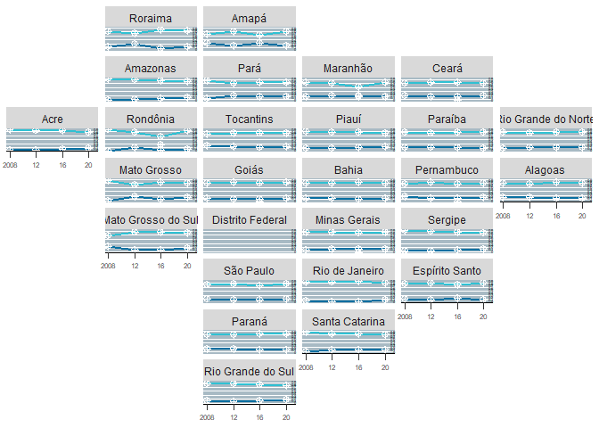

<!-- README.md is generated from README.Rmd. Please edit that file -->

# bd\_case

<!-- badges: start -->

<!-- badges: end -->

The goal of bd\_case is to …

``` r
library(basedosdados)
#> Warning: package 'basedosdados' was built under R version 4.0.5
#> 
#> -- Base dos Dados --------------------------------------------------------------
#> * Website: https://basedosdados.org/
#> * Docs: https://basedosdados.github.io/mais/
#> 
#> -- Contatos --
#> 
#> * Discord: discord.gg/tuaFbAPeq5
#> * Twitter: @basedosdados
#> * Email: contato@basedosdados.org
#> * Telegram: t.me/joinchat/OKWc3RnClXnq2hq-8o0h_w
#> * Github: github.com/basedosdados
#> * LinkedIn: linkedin.com/company/base-dos-dados
#> * Newsletter:
#> https://basedosdados.hubspotpagebuilder.com/assine-a-newsletter-da-base-dos-dados
#> * WhatsApp: https://chat.whatsapp.com/HXWgdFc1RmwCoblly5KPBZ
#> * YouTube: https://www.youtube.com/c/BasedosDados
#> 
#> -- Somos um projeto open-source e gratuito. Para nos mantermos e crescermos precisamos do seu apoio. Quanto valem as horas do seu trabalho que poupamos?
#> 
#> Nos apoie em https://apoia.se/basedosdados.
#> 
#> -- Usando o pacote para produzir um trabalho? Para nos citar basta rodar citation('basedosdados').
library(tidyverse)
#> -- Attaching packages --------------------------------------- tidyverse 1.3.0 --
#> v ggplot2 3.3.2     v purrr   0.3.4
#> v tibble  3.1.6     v dplyr   1.0.8
#> v tidyr   1.1.0     v stringr 1.4.0
#> v readr   2.1.2     v forcats 0.5.0
#> Warning: package 'tibble' was built under R version 4.0.5
#> Warning: package 'readr' was built under R version 4.0.5
#> Warning: package 'dplyr' was built under R version 4.0.5
#> -- Conflicts ------------------------------------------ tidyverse_conflicts() --
#> x dplyr::filter() masks stats::filter()
#> x dplyr::lag()    masks stats::lag()
library(geofacet)
#> Warning: package 'geofacet' was built under R version 4.0.5
```

What is special about using `README.Rmd` instead of just `README.md`?
You can include R chunks like so:

``` r
set_billing_id("casebd")
#> Project keys set successfully

## base de resultados
query <- bdplyr("br_tse_eleicoes.resultados_candidato") %>%
  select(ano, id_municipio, sigla_uf,
         turno, tipo_eleicao, cargo,
         numero_candidato, id_candidato_bd,
         resultado, ano)%>%
  filter(ano > 2007,cargo == "vereador", resultado != "nao eleito")
#> ! Using an auto-discovered, cached token.
#>   To suppress this message, modify your code or options to clearly consent to
#>   the use of a cached token.
#>   See gargle's "Non-interactive auth" vignette for more details:
#>   <https://gargle.r-lib.org/articles/non-interactive-auth.html>
#> i The bigrquery package is using a cached token for 'arthurgusmao@id.uff.br'.
#> Successfully connected to table `basedosdados.br_tse_eleicoes.resultados_candidato`.

df_resultado <- bd_collect(query)


## base de candidatos

query2 <- bdplyr("br_tse_eleicoes.candidatos") %>%
  select(ano,sigla_uf,id_candidato_bd,nome,situacao,ocupacao, genero, idade,instrucao,raca)%>%
  filter(ano > 2007)
#> Successfully connected to table `basedosdados.br_tse_eleicoes.candidatos`.
  #filter(str_detect(ocupacao,c("policia|militar reformado")))
  

df_candidatos <- bd_collect(query2)

#query3 <- bdplyr("br_me_siconfi.municipio_despesas_funcao")%>%
  #filter(sigla_uf == "RJ", ano >2012)

#df_despesas <- bd_collect(query3)

query4 <- bdplyr("br_bd_diretorios_brasil.uf")%>%
  select(sigla, nome)
#> Successfully connected to table `basedosdados.br_bd_diretorios_brasil.uf`.

diretorio <- bd_collect(query4)
```

You’ll still need to render `README.Rmd` regularly, to keep `README.md`
up-to-date. `devtools::build_readme()` is handy for this. You could also
use GitHub Actions to re-render `README.Rmd` every time you push. An
example workflow can be found here:
<https://github.com/r-lib/actions/tree/v1/examples>.

You can also embed plots, for example:

``` r


candidatos_merged <- merge(df_candidatos, df_resultado, by = c("id_candidato_bd","ano"))

diretorio <- diretorio %>%
  rename(nome_uf = nome, sigla_uf = sigla) #%>%
  #distinct(id_municipio, .keep_all = TRUE)

candidatos_merged <- merge(candidatos_merged, diretorio, by.x = "sigla_uf.x", by.y = "sigla_uf")


#df_despesas %>%
  #filter(estagio == "Despesas Pagas") %>% group_by(conta) %>% distinct(conta) %>% view()
```

## Calculando a proporção de militares eleitos

``` r

a <- candidatos_merged %>%
  filter(resultado != "suplente")%>%
  filter(tipo_eleicao == "eleicao ordinaria", situacao == "deferido")%>%
  mutate(militar = case_when(str_detect(ocupacao,c("policia|militar reformado"))~ "Policial ou Militar",TRUE ~ "Outras ocupações"))%>%
  group_by(ano, nome_uf, genero)%>%
  summarise(N = n()) %>%
  group_by(ano, nome_uf)%>%
  mutate(total = sum(N), proporcao =round(N/total,2))%>%
  mutate(genero = if_else(is.na(genero), "nao respondido", genero))%>%
  mutate(genero = as.factor(genero)) 
#> `summarise()` has grouped output by 'ano', 'nome_uf'. You can override using
#> the `.groups` argument.
```

``` r
# First, define colors.
BROWN <- "#AD8C97"
BROWN_DARKER <- "#7d3a46"
GREEN <- "#2FC1D3"
BLUE <- "#076FA1"
GREY <- "#C7C9CB"
GREY_DARKER <- "#5C5B5D"
RED <- "#E3120B"

plt1 <- a %>% 
  ggplot(aes(ano, proporcao)) +
  geom_line(aes(color = as.factor(genero)), size = 1) +
  geom_point(
    aes(fill = as.factor(genero)), 
    size = 2, 
    pch = 10, # Type of point that allows us to have both color (border) and fill.
    color = "white", 
    stroke = 1 # The width of the border, i.e. stroke.
  ) +
  # Set values for the color and the fill
  scale_color_manual(values = c(BLUE, GREEN, BROWN)) +
  scale_fill_manual(values = c(BLUE, GREEN, BROWN)) + 
  # Do not include any legend
  theme(legend.position = "none")
  

plt1 <- plt1 + 
  scale_x_continuous(
    limits = c(2007.5, 2021.5),
    expand = c(0, 0), # The horizontal axis does not extend to either side
    breaks = c(2008, 2012, 2016, 2020),  # Set custom break locations
    labels = c("2008", "12", "16", "20") # And custom labels on those breaks!
  ) +
  scale_y_continuous(
    limits = c(0, 1),
    breaks = seq(0, 1, by = 0.05), 
    expand = c(0, 0)
  ) + 
  theme(
    # Set background color to white
    panel.background = element_rect(fill = "white"),
    # Remove all grid lines
    panel.grid = element_blank(),
    # But add grid lines for the vertical axis, customizing color and size 
    panel.grid.major.y = element_line(color = "#A8BAC4", size = 0.3),
    # Remove tick marks on the vertical axis by setting their length to 0
    axis.ticks.length.y = unit(0, "mm"), 
    # But keep tick marks on horizontal axis
    axis.ticks.length.x = unit(2, "mm"),
    # Remove the title for both axes
    axis.title = element_blank(),
    # Only the bottom line of the vertical axis is painted in black
    axis.line.x.bottom = element_line(color = "black"),
    # Remove labels from the vertical axis
    axis.text.y = element_blank(),
    # But customize labels for the horizontal axis
    axis.text.x = element_text(size = 6)
  )

plt1 + 
  geom_text(
    data = data.frame(x = 2021.5, y = seq(0, 1, by = .1)),
    aes(x, y, label = y),
    hjust = 1, # Align to the right
    vjust = 0, # Align to the bottom
    nudge_y = 1 * 0.01, 
    size = 1
  ) +
  facet_geo(~ nome_uf, grid = "br_states_grid1")
#> Warning: Removed 48 rows containing missing values (geom_text).
```

<!-- -->

In that case, don’t forget to commit and push the resulting figure
files, so they display on GitHub.
